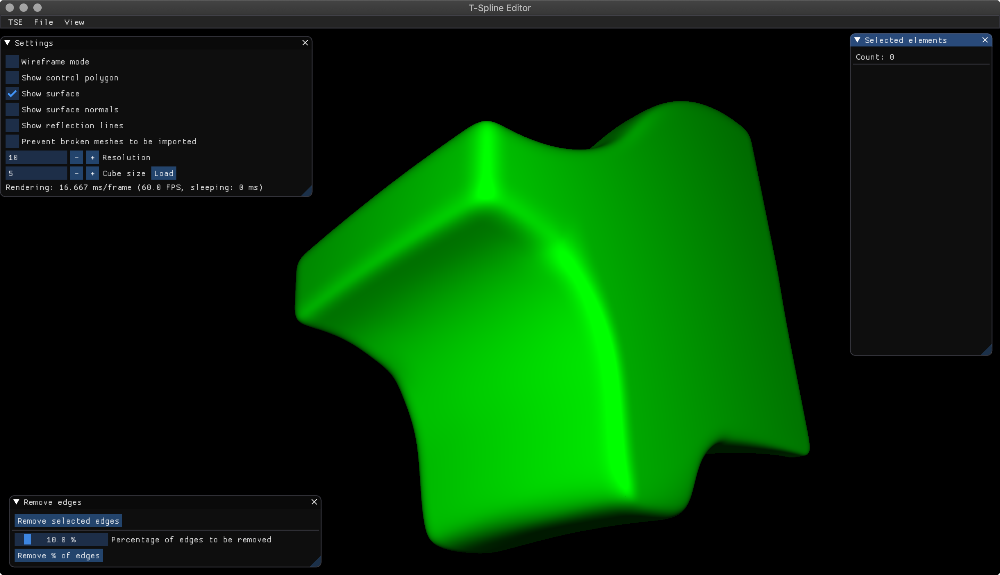
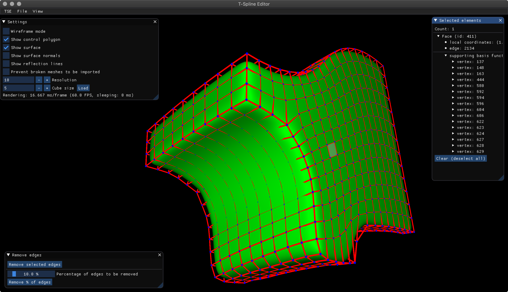

# T-Spline Library & T-Spline Editor
Library and editor for representation and manipulation of generalised T-Spline surfaces following [Similarity Maps and Field-Guided T-Splines: a Perfect Couple](https://doi.org/10.1145/3072959.3073647) written in C++.

This repository contains two C++ projects. One contains the library and can be found in the [tsl](tsl) folder and the other one contains the editor, which can be found in the [tse](tse) folder. For further informations please read the repsective README files in the two projects.

---
## Screenshots

---

## License
Licensed under either of

 * Apache License, Version 2.0, ([LICENSE-APACHE](LICENSE-APACHE) or http://www.apache.org/licenses/LICENSE-2.0)
 * MIT license ([LICENSE-MIT](LICENSE-MIT) or http://opensource.org/licenses/MIT)

at your option.

### Contribution
Unless you explicitly state otherwise, any contribution intentionally submitted
for inclusion in the work by you, as defined in the Apache-2.0 license, shall
be dual licensed as above, without any additional terms or conditions.
